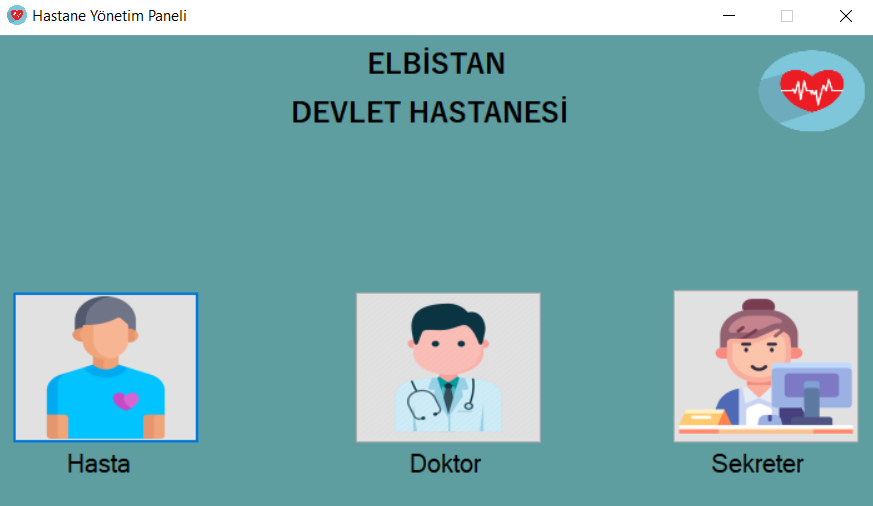
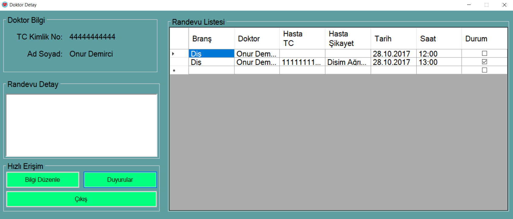
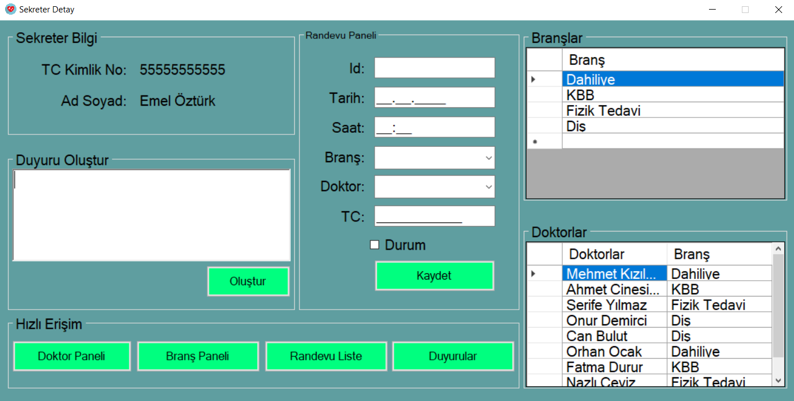
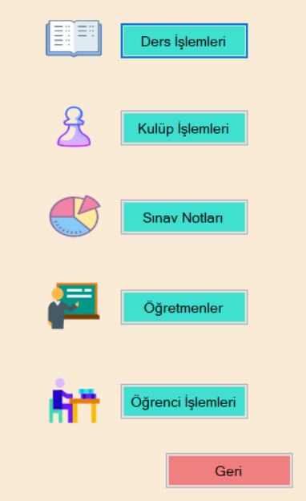
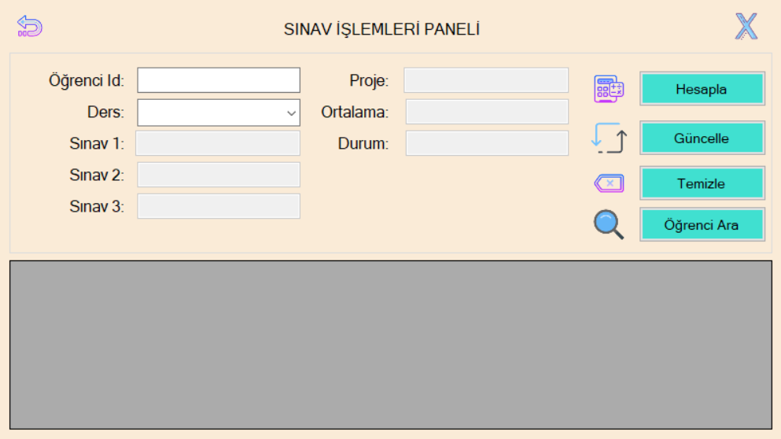
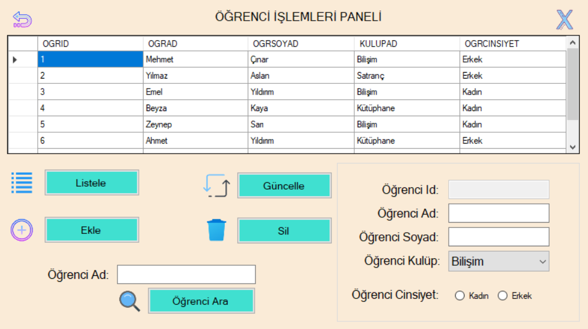

# AdanZyeCsharp
 Bu Repo'da, Murat Yücedağ'ın Udemy'de bulunan "Uygulama Geliştirerek C# Öğrenin: A'dan Z'ye Eğitim Seti" kursunda yapmış olduğum bir çok  uygulama bulunmaktadır. Hastane Yönetim Paneli ve E-Okul benzeri uygulamalar başta olmak üzere birçok eğitici ve kapsamlı içerikle mevcut.

 ## 📸 Kurs Kapsamn Yapılan Projelerin Bazı Ekran Görüntüleri  

### Admin Paneli  

